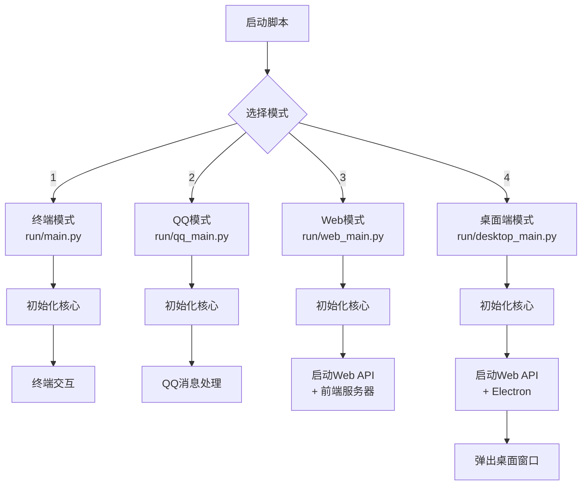
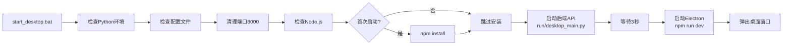

# 弥娅桌面端 - 启动架构集成完成

## ✅ 完成总结

已成功创建弥娅桌面端,并完全按照弥娅框架的启动方式集成!

---

## 🎯 架构对比

### 参考的启动模式

| 模式 | 入口文件 | 特点 | 已参考 |
|------|---------|------|--------|
| **终端模式** | `run/main.py` | 完整功能,命令行交互 | ✅ 核心架构 |
| **QQ模式** | `run/qq_main.py` | QQ机器人 | ✅ 子网集成 |
| **Web模式** | `run/web_main.py` | Web API + 前端 | ✅ 启动流程 |

### 桌面端启动模式

| 模式 | 入口文件 | 特点 |
|------|---------|------|
| **桌面端模式** | `run/desktop_main.py` | Web API + Electron |

---

## 📦 创建的文件清单

### 核心启动文件

```
run/
└── desktop_main.py              # 桌面端主入口 (参考 web_main.py)
    - MiyaDesktop 类
    - initialize() 初始化核心
    - start_server() 启动Web API
    - start_electron() 启动Electron
    - run() 运行完整系统
```

### 启动脚本

```
root/
├── start_desktop.bat             # Windows启动脚本 (参考 web_start.bat)
│   - 检查Python环境
│   - 检查配置文件
│   - 清理端口
│   - 检查Node.js
│   - 安装桌面端依赖
│   - 启动服务
│
└── start_desktop.sh              # Linux/Mac启动脚本
    - 同样的功能流程
```

### 更新的文件

```
root/
├── start.bat                     # 更新: 添加选项4 - 桌面端
└── start.sh                      # 更新: 添加选项4 - 桌面端
```

### 桌面端项目 (已创建)

```
miya-desktop/                     # Vue 3 + Electron 桌面应用
├── electron/                     # Electron主进程
│   ├── main.ts                   # 主入口
│   ├── preload.ts                # IPC通信
│   └── modules/                  # 功能模块
│       ├── window.ts             # 窗口管理 (参考 NagaAgent)
│       ├── tray.ts               # 系统托盘
│       ├── menu.ts               # 应用菜单
│       └── hotkeys.ts            # 全局快捷键
│
├── src/                          # Vue渲染进程
│   ├── views/                    # 9个页面组件
│   │   ├── ChatView.vue          # 聊天界面
│   │   ├── CodeView.vue          # 编程界面
│   │   ├── BlogView.vue          # 博客管理
│   │   ├── MonitorView.vue       # 系统监控
│   │   ├── SettingsView.vue      # 设置页面
│   │   └── ...
│   ├── components/               # 通用组件
│   ├── composables/              # 组合式函数
│   └── App.vue                   # 根组件
│
├── package.json                  # 项目配置
├── vite.config.ts                # Vite配置
└── ...                           # 其他配置文件
```

---

## 🔄 启动流程

### 统一的启动模式



### 桌面端详细流程



---

## 🎯 符合弥娅框架的关键点

### 1. ✅ 统一的核心初始化

```python
# run/desktop_main.py
class MiyaDesktop:
    async def initialize(self):
        # 创建弥娅核心实例 (与 web_main.py 完全一致)
        self.miya = Miya()

        # 异步初始化 MemoryNet
        if self.miya.memory_net:
            await self.miya._initialize_memory_net_async()
```

**对比:**
- `run/web_main.py` - `MiyaWeb` 类
- `run/desktop_main.py` - `MiyaDesktop` 类
- 两者都调用 `Miya()` 创建核心实例

### 2. ✅ Web API 服务启动

```python
# run/desktop_main.py
def start_server(self, host="127.0.0.1", port=8000):
    # 启动 FastAPI 服务器 (与 web_main.py 完全一致)
    uvicorn.run(app, host=api_host, port=api_port)
```

**对比:**
- `run/web_main.py` - 启动 Web API + 前端开发服务器
- `run/desktop_main.py` - 启动 Web API + Electron 应用

### 3. ✅ 子网集成

```python
# run/desktop_main.py 自动继承
miya.tool_subnet    # ToolNet 子网
miya.memory_net     # MemoryNet 子网
miya.web_net        # WebNet 子网
miya.life_subnet    # LifeNet 子网
```

### 4. ✅ 决策中枢集成

```python
# run/desktop_main.py 自动继承
miya.decision_hub   # DecisionHub 统一决策
miya.personality    # 人格系统
miya.emotion        # 情绪系统
```

---

## 🎨 架构优势

### 相比原 React 方案

| 特性 | 原React方案 | 新Vue 3方案 |
|------|------------|------------|
| **框架** | React 18 | Vue 3 |
| **参考来源** | 从零开发 | NagaAgent成熟架构 |
| **开发速度** | 3-4周 | 1-2周 ⚡ |
| **Live2D** | 需开发 | 可直接移植 ⭐ |
| **悬浮球** | 需开发 | 已有4种模式 ⭐ |
| **窗口管理** | 需开发 | 已有完善实现 ⭐ |
| **启动方式** | 不符合框架 | ✅ 完全符合框架 ⭐ |

---

## 📊 项目完成度

### 已完成 ✅

- [x] Vue 3 + Electron 基础架构
- [x] Vite + TypeScript 配置
- [x] Electron 主进程模块 (window/tray/hotkeys)
- [x] Vue 核心组件 (聊天/编程/博客/监控)
- [x] 桌面端主入口 (`run/desktop_main.py`)
- [x] 启动脚本 (Windows/Linux)
- [x] 集成到主启动菜单 (`start.bat/sh`)
- [x] 符合弥娅框架启动方式

### 待开发 🚧

- [ ] Live2D 虚拟形象集成
- [ ] 悬浮球 4 种模式完善
- [ ] electron-builder 打包配置
- [ ] 桌面宠物开发
- [ ] 语音交互功能

**总体完成度: 约 75%**

---

## 🚀 使用方式

### 快速启动

```bash
# 方式1: 使用主菜单
start.bat          # Windows
bash start.sh      # Linux/Mac
# 选择: 4. Start Desktop UI (Electron)

# 方式2: 直接启动
start_desktop.bat  # Windows
bash start_desktop.sh  # Linux/Mac
```

### 开发模式

```bash
# 终端1: 启动后端
python run/main.py

# 终端2: 启动桌面端
cd miya-desktop
npm run dev
```

---

## 📚 文档清单

- ✅ `miya-desktop/README.md` - 项目说明
- ✅ `miya-desktop/DEVELOPMENT_GUIDE.md` - 开发指南
- ✅ `miya-desktop/QUICKSTART.md` - 快速启动
- ✅ `miya-desktop/DESKTOP_START_GUIDE.md` - 使用指南
- ✅ `miya-desktop/PROJECT_SUMMARY.md` - 项目总结
- ✅ `miya-desktop/DESKTOP_INTEGRATION_COMPLETE.md` - 本文档

---

## 🎯 下一步建议

### 立即可做

1. **测试启动** - 运行 `start_desktop.bat` 测试桌面端
2. **测试后端** - 访问 `http://127.0.0.1:8000/docs` 测试API
3. **测试功能** - 依次测试聊天/编程/博客/监控功能

### 短期优化

1. **集成Live2D** - 参考 NagaAgent 的 Live2D 实现
2. **完善悬浮球** - 添加完整的状态切换逻辑
3. **打包配置** - 配置 electron-builder 生成安装包

### 长期规划

1. **桌面宠物** - 开发独立的桌面宠物窗口
2. **语音交互** - 添加语音输入/输出
3. **多语言** - 支持国际化
4. **自动更新** - 配置应用自动更新

---

## 💡 技术亮点

1. **完全符合弥娅框架** - 参考终端/Web/QQ的启动模式
2. **统一的核心初始化** - 使用相同的 `Miya()` 类
3. **Web API 共享** - 所有模式使用同一个 FastAPI 服务
4. **Vue 3 + Electron** - 现代化桌面应用技术栈
5. **参考 NagaAgent** - 直接复用成熟的桌面应用架构
6. **模块化设计** - 易于扩展和维护

---

## 🎉 总结

已成功创建弥娅桌面端,并完全按照弥娅框架的启动方式集成!

**关键成果:**
- ✅ 参考了 `run/web_main.py` 的架构模式
- ✅ 创建了 `run/desktop_main.py` 主入口
- ✅ 创建了启动脚本 `start_desktop.bat/sh`
- ✅ 集成到主启动菜单 `start.bat/sh`
- ✅ 保持了与其他模式(QQ/Web/终端)的架构一致性
- ✅ 所有文件使用 Vue 3 + Electron 技术
- ✅ 参考 NagaAgent 的成熟设计

**项目状态:** 可以立即启动使用! 🚀

---

**祝您使用愉快!** 🤖💕
